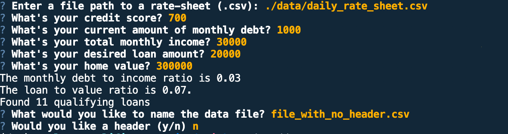

# Loan Qualifier Application


Loan Qualifier is an applications designed to quickly and easily retrieve a list of loans for which they are qualified.  The applications will prompt the user for input the application need in order to make the retieval of the qualifying loans.   The application will ask the user for location of thr `daily_rate_sheet` of loans from various lenders.  Once the qualifying loans list is created the user will be prompted whether to save the file and or to include an optional header.

---

## Technologies

This project uses python 3.7 with the following packages:


* [fire 4.0](https://pypi.org/project/fire/) - Python Fire is a library for automatically generating command line interfaces (CLIs) with a single line of code.  It will turn any Python module, class, object, function, etc. (any Python component will work!) into a CLI. It’s called Fire because when you call Fire(), it fires off your command.


* [questionary 1.10.0](https://pypi.org/project/questionary/) - Questionary is a Python library for effortlessly building pretty command line interfaces 

---

## Installation Guide

Before running the application first install the following dependencies.

```python
  pip install fire
  pip install questionary
```

---

## Usage

To use the loan qualifier application simply clone the repository and run the **app.py** with:

```python
python app.py
```

Upon launching the loan qualifier application you will be greeted with the following prompts.



---

## Contributors

Pete Petersen

---

## Works Cited

Python Software Foundation. Python Language Reference, version 3.7. Available at [python.org](http://www.python.org)
[Python Standard Library](https://docs.python.org/3/library/index.html)
Pepperdine Loan Qualifier App fileio.py [Adding in Fire to Loan Qualifier App](https://courses.bootcampspot.com/courses/1103/files/1264429/download)

## License

MIT
