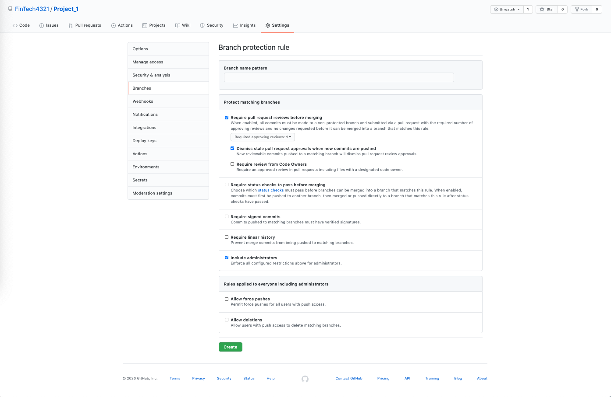

# Create a Repository and Protect the Main Branch

In this activity, you will create a GitHub repository, add group members as collaborators, and protect your repository's main branch.

## Instructions

The instructions are divided into two parts. In Part 1, you will create a repository and invite team members to be collaborators. In Part 2, you will protect the repository’s main branch by requiring pull requests for all merges.

### Part 1: Create a Repository and Invite Collaborators

In this section, you will create a new repository for your team’s project and invite team members to be collaborators on that repository. Only ONE member of the group should complete the following steps. That group member should share their screen so the other group members can observe the process.

1. Assign the repository a project name. Don't worry about the project name now; you can change this later. The repository should be public. Be sure to check both the “Add a README file” and “Add .gitignore” boxes, and select “Python” for your .gitignore file type.

2. From the repository's main page, click the "Settings" tab.

3. Once in the repository's settings, select the "Manage access" menu item on the left.

4. From the "Manage access" page, invite your group members to be project collaborators by clicking on the “Invite a collaborator” button and entering their GitHub usernames one at a time.

5. Each group member should receive an invitation in the email account that is associated with their Github repository. They must open the email to accept the invitation.

### Part 2: Protect the Main Branch by Requiring Pull Requests

In this section, you will protect the repository’s main branch by requiring pull requests be made and reviewed by a team member before any work can be merged. The group member that initiated that project’s repository should also complete this part of the activity. That group member should share their screen so the other group members can observe the process.

1. Navigate back to the repository's "Settings" page and select "Branches" from the left sidebar.

2. You will notice a section called “Default branch”. This section declares “main” as the default branch. Any of the branch protection rules that you assign will apply to the “main” branch.

3. In the “Branch protection rule” section, click the button “Add rule”.  You will see several options. Complete the following:

  * Add a “Branch name pattern”, such as “project-1”.

  * Check the box for "Require pull request reviews before merging". In that section, also check “Dismiss stale pull request approvals when new commits are pushed”.

  * Check the box for  "Include administrators".

  * Click the “Create” button and then return to the main repository page.

 

If completed successfully, no one should be able to push directly to the main branch. Instead, all changes must be made as pull requests and reviewed by another group member. The process of making and reviewing pull requests will be examined over the next set of activities.

---

© 2021 Trilogy Education Services, LLC, a 2U, Inc. brand. Confidential and Proprietary. All Rights Reserved.
